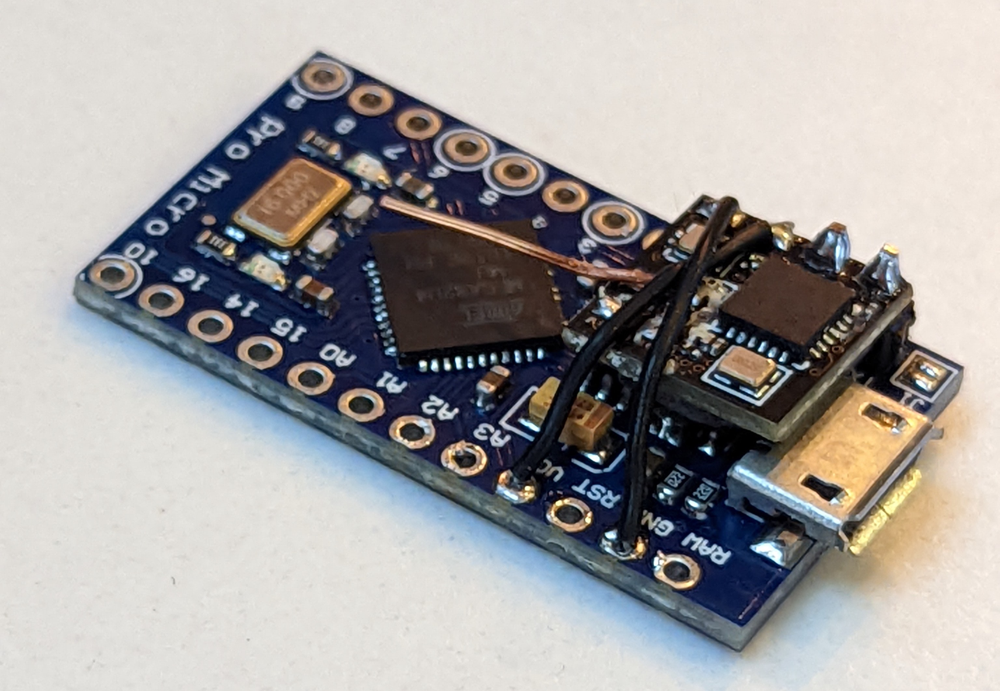
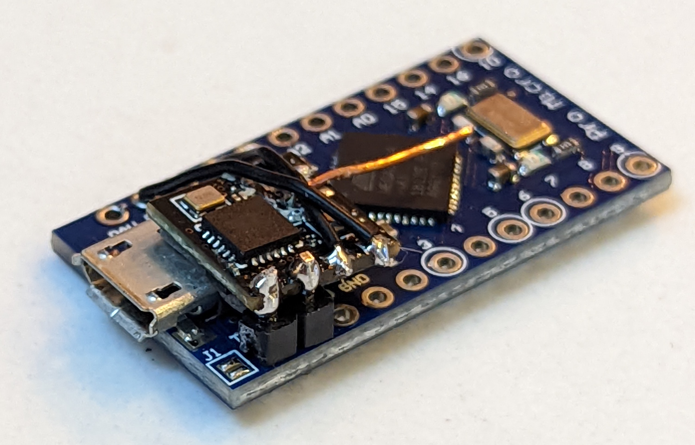

# CRSFJoystickProMicro
A clone of https://github.com/mikeneiderhauser/CRSFJoystick to support the Arduino Pro Micro (atmega32u4)

This is a project to build an ExpressLRS HID jotstick dongle.
It is a fork of the excellent [CRSFJoystick](https://github.com/mikeneiderhauser/CRSFJoystick) project from [Mike Neiderhauser](https://github.com/mikeneiderhauser). The main difference is the use of the ArduinoJoystick library which supports the AVR platform.

The motivation for this fork was to one of the smaller Pro Micro devices which I already owned.
If you do not already have a suitable Atmega32u4 device then I recommend using a Pi Pico with the original project instead, as they are more readily available.

## Note

If you build this project you MUST flash your receiver with `RCVR_UART_BAUD=250000`.